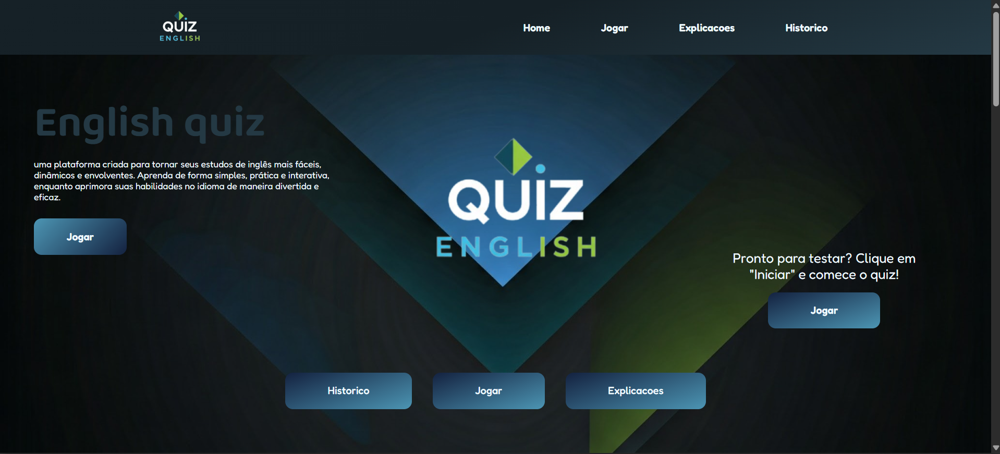
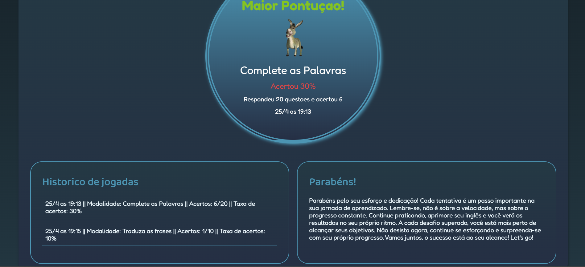
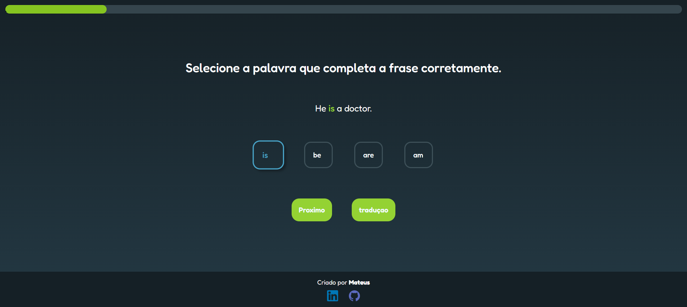
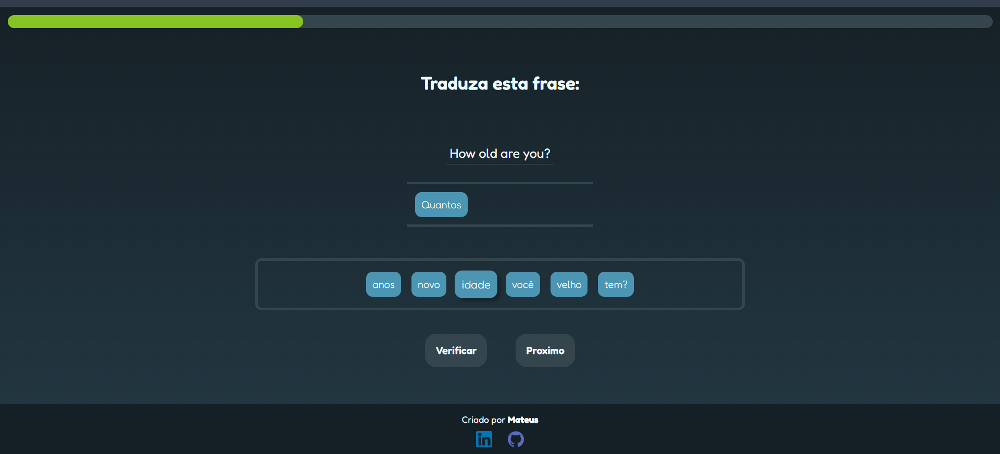

<h1 align="center" style="font-weight: bold;">Nome do Projeto 💻</h1>

<p align="center">
 - <a href="#layout">Layout</a> 
 - <a href="#sobre">Sobre</a> 
 - <a href="#tecnologias-utilizadas">Tec Utilizadas</a>
 - <a href="#como-usar">Instruções de uso </a>  
 - <a href="#funcionalidades">Funcionalidades</a>  
 - <a href="#estrutura do projeto">estrutura do projeto</a>  
 - <a href="#status">Status</a> 
</p>

<p align="center">
    <b>Descrição curta do projeto — o que ele faz e pra quem.</b>
</p>

<p align="center">
     <a href="URL_DO_PROJETO">📱 Ver Projeto</a>
</p>

---

<h2 id="layout">🎨 Layout</h2>

<p align="center">
    
    
    
    
</p>

---
<br>

<h2 id="sobre">💡 Sobre</h2>
Este projeto foi desenvolvido como uma forma prática de estudar inglês por meio de exercícios interativos, funcionando como uma espécie de “Duolingo personalizado”. A proposta é oferecer uma ferramenta simples e acessível para praticar o idioma no dia a dia, tanto para uso próprio quanto para colegas de curso, facilitando o aprendizado de forma dinâmica e focada na prática.

---
<br>

<h2 id="funcionalidades">⚡ Funcionalidades</h2>

<h3> 🎮 Complete a frase</h3>
<p>
Nesta modalidade, o usuário seleciona um tema e responde a frases com lacunas (___), escolhendo a opção correta para completá-las.

**Ao selecionar uma resposta:**
- A frase é preenchida automaticamente
- sistema indica se está correta ou incorreta com feedback visual

**A funcionalidade também inclui:**
- Barra de progresso
- Botão de tradução da frase
- Sistema de pontuação

Ao final, o usuário recebe um resumo de desempenho, com feedback visual e sonoro, e os dados da partida são salvos no localStorage para exibição no histórico.
</p>


<h3> 🎮 Traduza a frase </h3>
<p>
Nesta modalidade, o usuário deve traduzir frases montando a resposta correta com palavras disponíveis.

**O sistema funciona com interação de arrastar e soltar (drag and drop):**
- O usuário organiza as palavras na ordem correta para formar a tradução
- Após preencher todas as lacunas, pode verificar a resposta
- O sistema indica acertos e erros com feedback visual (cores)


**A funcionalidade também inclui:**
- Barra de progresso
- Sistema de pontuação
- Controle de avanço por questão (só libera após verificação)

Ao final, o usuário recebe um resumo de desempenho, com feedback visual e sonoro, e os dados da partida são salvos no localStorage para exibição no histórico.
</p>


<h3>📜 visualizaçao de historico </h3>
<p>
A funcionalidade de histórico permite ao usuário visualizar todas as partidas realizadas, com dados armazenados no localStorage.

**São exibidas informações como:**
- Data da partida
- Modalidade jogada
- Quantidade de acertos
- Taxa de desempenho (%)

Além disso, o sistema destaca automaticamente a melhor partida, com base na maior taxa de acertos, exibindo um resumo com feedback visual (imagem e cores).

Caso não existam dados salvos, uma mensagem é exibida orientando o usuário a jogar para gerar histórico.
</p>

----
<br>

<h2 id="tecnologias-utilizadas">💻 Tecnologias Utilizadas</h2>

- **HTML**
- **CSS3**
- **JAVASCRIPT**

---
<br>

<h2 id="estrutura do projeto">⚡ Estrutura do projeto </h2>

```
/QUIZ-ENGLISH
├─ index.html                    # Página inicial do projeto
├─ complete.html                 # Página de completar frases
├─ explicacoes.html              # Página de explicações
├─ historico.html                # Página de histórico de partidas
├─ modalidade.html               # Página de seleção de modalidades
├─ traduza.html                  # Página de tradução de frases
│
├─ artigos/                      # Artigos educacionais
│  ├─ pronomes.html              # Artigo sobre pronomes
│  └─ toBe.html                  # Artigo sobre o verbo "To Be"
│
├─ audios/                       # Arquivos de áudio para as atividades
│
├─ css/                          # Arquivos de estilos
│  ├─ home.css                   # Estilos da página inicial
│  ├─ complete.css               # Estilos de completar frases
│  ├─ explicacoes.css            # Estilos das explicações
│  ├─ historico.css              # Estilos do histórico
│  ├─ modalidades.css            # Estilos das modalidades
│  ├─ traduza.css                # Estilos da tradução
│  └─ menuFoter.css              # Estilos do menu e footer
│
├─ img/                          # Imagens do projeto (prints, ícones, etc)
│
├─ scripts/                      # Arquivos JavaScript
│  ├─ home.js                    # Lógica da página inicial
│  ├─ complete.js                # Lógica da modalide: completar frases
│  ├─ historico.js               # Lógica da pagina de histórico
│  ├─ questions.js               # Dados usados em complete a frase
│  ├─ menuFoter.js               # Lógica do menu e footer
│  ├─ aryFrasesTraduzir.js       # Dados usados em: traduza a frase 
│  └─ traduzaDragAndDrop.js      # Lógica da modalidade: traduza a frase
│
└─ README.md                     # Documentação do projeto
```


---
<br>

<h2 id="como-usar">📚 Instruções de Uso</h2>

<h3 id="funcionalidades-principais">⚙️ Como Usar:</h3>

<h4>🎮 Jogar</h4>
Comece sua jornada de aprendizado:
1. Clique no botão **"Jogar"** na página inicial
2. Escolha entre as duas modalidades de jogos:
   - **Completar Frases**: Complete as frases com as palavras corretas
   - **Traduzir Frases**: Traduza as frases usando o sistema de arrastar e soltar
3. Responda as perguntas e aprenda divertindo-se!

<h4>📚 Explicações</h4>
Aprofunde seu conhecimento nos temas abordados nos jogos:
- Acesse artigos educacionais sobre temas importantes como o verbo "To Be", pronomes e outras estruturas gramaticais
- Use como referência antes ou depois de jogar para melhorar seu desempenho

<h4>📊 Histórico</h4>
Acompanhe seu progresso ao longo do tempo:
- Visualize sua **melhor partida** em destaque
- Consulte o histórico completo de todas as suas partidas com informações detalhadas:
  - Data da partida
  - Modalidade jogada
  - Questões acertadas
  - Taxa de acerto (%)

---

<br>

<h2 id="status">🚧 Status do Projeto</h2>

<p> 
O projeto está em constante evolução. Atualmente, estou trabalhando na melhoria da experiência do usuário e na adição de novos temas para as modalidades já existentes, ampliando a variedade de exercícios e tornando a prática do inglês mais completa e dinâmica.
</p>

---
 <br>


<h2 id="colab">🤝 Colaboradores</h2>

Um agradecimento especial a todas as pessoas que contribuíram para este projeto.
<table>
  <tr>
    <td align="center">
      <a href="#"><br>
        <sub>
          <b>Mateus Marques</b>
        </sub>
      </a>
    </td>
    <td align="center">
      <a href="#">
        <br>
        <sub>
          <b>Elon Musk</b>
        </sub>
      </a>
    </td>
  </tr>
</table>